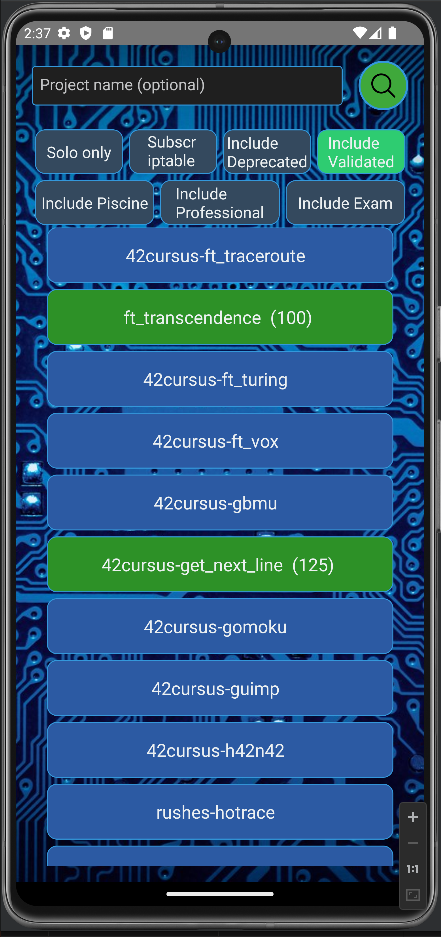
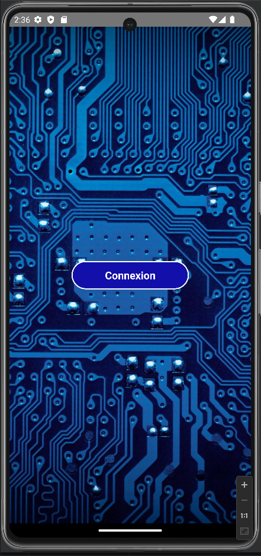
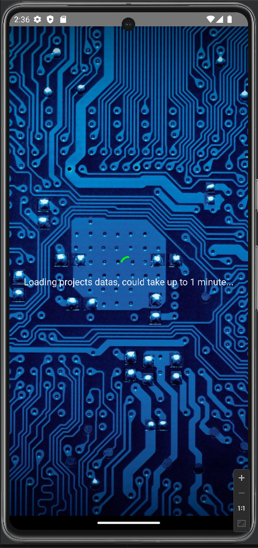
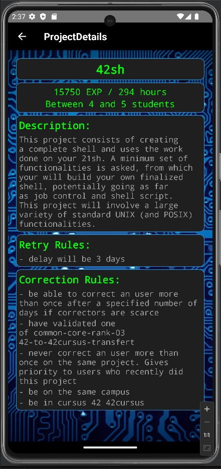

# 42SchoolProjects - React Native

Welcome to the 42SchoolProjects repository, developed using React Native! This application is compatible with Android platforms.



Follow the instructions below to set up and test the application.

**Developed and tested on a Linux Ubuntu 23.04 and Android 12 / 13**

----

## Prerequisites

### Development Environment

**Node.js & npm**: Required to manage the project's dependencies and run the development server -> [Download Node.js](https://nodejs.org/).

**React Native CLI**: Used to initiate new React Native projects and execute commands.

``npm install -g react-native-cli``

**Android Studio & Android SDK**: Required for emulating and debugging React Native applications for Android -> [Download Android Studio](https://developer.android.com/studio).

### API Access

You have to create an application on your 42 profile, with this redirect URI : **projects42://callback**


----
## Installation

1. **Clone the repository:**

````
git clone https://github.com/jmbertin/42SchoolProjects
cd 42SchoolProjects
````


3. **Install the dependencies:**

````
chmod +x manage.sh
./manage.sh install
````

4. **Create a .env file on the root folder of the project :**

````
CLIENT_ID=u-******************************** (replace by your UID)
CLIENT_SECRET=s-******************************** (replace by your SECRET)
````

5. **Running**

Start an Android emulator through Android Studio or connect an Android device with USB debugging mode enabled then :

````
./manage.sh start
````

And press **a** button in the Metro menu.

6. **Stop**

Just press **CTRL+C**.


7. **Build bundle & APK**

- First generate a key :
``keytool -genkeypair -v -storetype PKCS12 -keystore my-release-key.p12 -alias my-key-alias -keyalg RSA -keysize 2048 -validity 10000``

- Then edit the files, and replace ****** by the password choosen for the key :

**android/gradle.properties**
````
MYAPP_RELEASE_STORE_PASSWORD=******
MYAPP_RELEASE_KEY_PASSWORD=******
````

**android/app/build.gradle**
````
storePassword '******'
keyPassword '******'
````

- Now you can build your app :

````
./manage.sh build
````
Two versions will be managed, one in a format compatible with distribution on the Google Store (.aab), the second, installable directly on Android phone (.apk).

````
android/app/build/outputs/apk/release/app-release.apk
android/app/build/outputs/bundle/release/app-release.aab
````

1. **Cleaning**

````
./manage.sh clean
````

----

## Screenshots






----

## Contributing
If you wish to contribute to the project, please create a pull request and detail the changes you're proposing.
